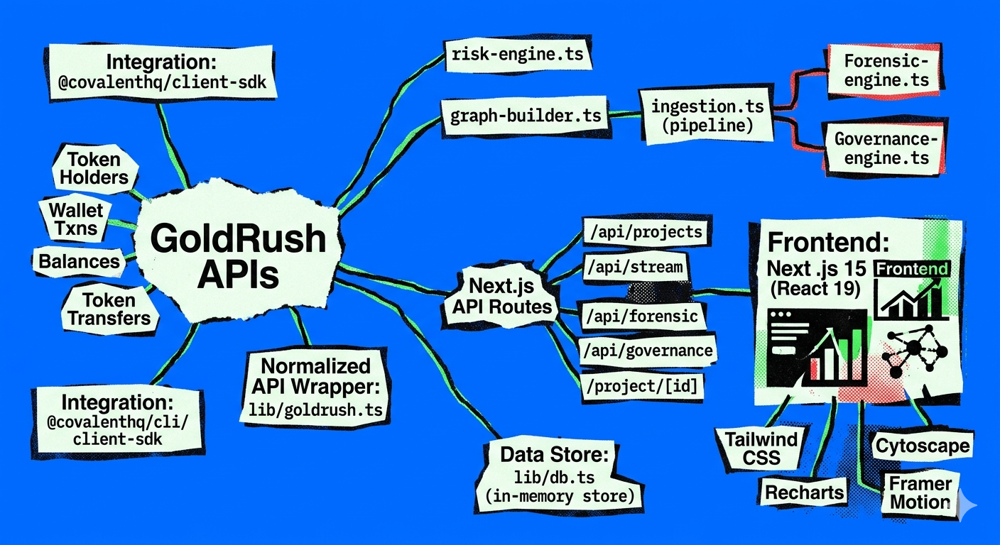

# RUG DNA — Onchain Behavioral Intelligence

> **Built for the [Build with GoldRush](https://goldrush.dev) Track · Superteam Earn Hackathon** &nbsp;·&nbsp; [🚀 Live Demo](https://rug-dna-app.vercel.app) &nbsp;


---

## ⚡ TLDR

**RUG DNA** is an AI-powered onchain surveillance platform that monitors token launches in real time, scores them for rug-pull risk (0–100), auto-generates forensic case files when a project breaches a critical threshold, and evaluates DAO governance health — all powered by the **GoldRush / Covalent API** (`@covalenthq/client-sdk`).

| Capability | What it does |
|---|---|
| 🔴 Risk Scoring | Heuristic engine scores each token 0–100 across 6 signal categories |
| 🔬 Forensic Mode | Auto-generates case files with timeline, extraction path & AI narrative |
| 🏛 Governance Trust | Decentralization credibility score for DAOs |
| 📡 Live Feed | SSE stream of real-time alerts from GoldRush data |

---

## 🖥 Demo

1. **`/`** — Risk Monitor: all tracked projects sorted by threat level
2. **Click a critical project** (e.g. `$RUGX`) → project detail with wallet graph + evidence
3. **"View Full Case File"** → forensic reconstruction with timeline
4. **Governance tab** → decentralization credibility analysis

---

## 🏗 Architecture



```
┌──────────────────────────────────────────────────────────────┐
│                      GoldRush APIs                           │
│  Token Holders · Wallet Txns · Balances · Token Transfers    │
└──────────────────┬───────────────────────────────────────────┘
                   │ @covalenthq/client-sdk
                   ▼
          ┌─────────────────┐
          │  lib/goldrush.ts │  ← Normalized API wrapper
          └────────┬────────┘
                   │
       ┌───────────┼────────────────────┐
       ▼           ▼                    ▼
 risk-engine  graph-builder        ingestion.ts
    .ts           .ts               (pipeline)
       │           │                    │
       │      forensic-engine      governance-engine
       │          .ts                  .ts
       └───────────┴──────────────────┘
                   │
             lib/db.ts (in-memory store)
                   │
          Next.js API Routes
                   │
     ┌─────────────┼───────────────────┐
     ▼             ▼                   ▼
/api/projects  /api/stream        /api/forensic
/api/governance                  /project/[id]
     │
     ▼
Next.js 15 Frontend (React 19)
Tailwind CSS · Recharts · Cytoscape · Framer Motion
```

---

## 🔗 GoldRush Integration

RUG DNA is deeply integrated with **GoldRush by Covalent** for all onchain data.

### APIs Used

| Endpoint | GoldRush Function | Purpose |
|---|---|---|
| `/{chain}/tokens/{addr}/token_holders_v2/` | `getTokenHolders()` | Holder concentration analysis |
| `/{chain}/address/{addr}/transactions_v3/` | `getWalletTransactions()` | Fund-flow graph construction |
| `/{chain}/address/{addr}/balances_v2/` | `getWalletBalances()` | Wallet wealth profiling |
| `/{chain}/address/{addr}/transfers_v2/` | `getTokenTransfers()` | Transfer pattern detection |
| `/{chain}/tokens/{addr}/` | `getTokenMetadata()` | Token name, symbol, supply |
| `/{chain}/xy=k/{dex}/pools/` | `getDexPools()` | Liquidity pool analysis |

### SDK Usage

```ts
// lib/goldrush.ts
import { GoldRushClient } from '@covalenthq/client-sdk';

const client = new GoldRushClient(process.env.GOLDRUSH_API_KEY!);

// Example: fetch top 100 token holders
const holders = await getTokenHolders('eth-mainnet', tokenAddress, 100);
```

### Risk Signals from GoldRush Data

The **Risk Engine** (`lib/risk-engine.ts`) extracts 6 categories of risk signals:

```
┌─────────────────────────────┬──────────────────────────────────────┐
│ Signal Category              │ GoldRush Data Used                   │
├─────────────────────────────┼──────────────────────────────────────┤
│ Holder Concentration         │ token_holders_v2 → top-10 balance %  │
│ Deployer Behavior            │ transactions_v3 → deployer patterns   │
│ Liquidity Depth              │ xy=k pools → total_liquidity_quote   │
│ Transfer Velocity            │ transfers_v2 → tx frequency spike    │
│ Mint/Burn Anomalies          │ transfers_v2 → mint events           │
│ Wallet Graph Clustering      │ balances_v2 → cross-wallet links     │
└─────────────────────────────┴──────────────────────────────────────┘
```

### Adding a Real Token

```bash
curl -X POST http://localhost:3000/api/projects \
  -H "Content-Type: application/json" \
  -d '{"tokenAddress": "0xYourToken", "chain": "eth-mainnet"}'
```

---

## 🚀 Quick Start

### Prerequisites
- Node.js 18+
- A [GoldRush API Key](https://goldrush.dev) (free tier available)

### Installation

```bash
git clone https://github.com/adirathoreudr/rug-dna.git
cd rug-dna
npm install
cp .env.example .env.local
```

Edit `.env.local`:
```env
GOLDRUSH_API_KEY=your_key_from_goldrush.dev
```

```bash
npm run dev
```

Open [http://localhost:3000](http://localhost:3000)

---

## 🗂 Project Structure

```
rug-dna-app/
├── app/
│   ├── page.tsx              # Risk Monitor dashboard (main view)
│   ├── layout.tsx            # Root layout + fonts
│   ├── globals.css           # Design tokens, animations
│   ├── api/
│   │   ├── projects/route.ts # GET all projects / POST ingest token
│   │   ├── stream/route.ts   # SSE live intelligence feed
│   │   ├── forensic/route.ts # Forensic case files
│   │   └── governance/route.ts
│   ├── project/[id]/         # Project detail page
│   ├── case/[id]/            # Full forensic case file view
│   └── governance/           # Governance analysis view
│
├── lib/
│   ├── goldrush.ts           # ← GoldRush API client (all data fetching)
│   ├── risk-engine.ts        # Heuristic 0–100 risk scorer
│   ├── graph-builder.ts      # Wallet behavioral graph (Cytoscape)
│   ├── forensic-engine.ts    # Auto case file generation
│   ├── governance-engine.ts  # DAO trust scoring
│   ├── ingestion.ts          # Data pipeline + mock seeding
│   └── db.ts                 # In-memory data store
│
├── components/               # UI components
├── types/                    # TypeScript type definitions
├── public/
│   └── dashboard-preview.png # Dashboard screenshot
├── .env.example              # Environment variable template
└── vercel.json               # Vercel deployment config
```

---

## 🛠 Tech Stack

| Layer | Technology |
|---|---|
| Framework | Next.js 15 (App Router) |
| Language | TypeScript 5 |
| Styling | Tailwind CSS 4 + custom design tokens |
| Onchain Data | **GoldRush / Covalent** (`@covalenthq/client-sdk`) |
| Graph Visualization | Cytoscape.js |
| Charts | Recharts |
| Animations | Framer Motion |
| State | Zustand |
| Deploy | Vercel |

---

## 🌐 API Reference

| Route | Method | Description |
|---|---|---|
| `/api/projects` | `GET` | List all monitored projects with risk scores |
| `/api/projects` | `POST` | Ingest a new token by contract address + chain |
| `/api/stream` | `GET` | SSE live intelligence feed |
| `/api/forensic` | `GET` | All open forensic case files |
| `/api/forensic?id=FCS-xxxx` | `GET` | Single case file |
| `/api/governance` | `GET` | Governance trust scores |

---

## ⚙️ Environment Variables

Copy `.env.example` and fill in your keys:

```env
# Required — get from https://goldrush.dev (free)
GOLDRUSH_API_KEY=cqt_your_key_here

# Optional — for AI narrative generation
ANTHROPIC_API_KEY=sk-ant-your_key_here

# App URL (auto-set on Vercel)
NEXT_PUBLIC_APP_URL=http://localhost:3000
```

> **Note:** The app runs with mock data if no API key is provided (for demo purposes).

---

## ☁️ Deploy on Vercel

[](https://vercel.com/new)

1. Repo is already live at [github.com/adirathoreudr/rug-dna](https://github.com/adirathoreudr/rug-dna)
2. Deployment is live at [rug-dna-app.vercel.app](https://rug-dna-app.vercel.app)
3. To add your GoldRush key: go to [vercel.com](https://vercel.com) → Project → Settings → Environment Variables
3. Framework: **Next.js** (auto-detected)
4. Add environment variable: `GOLDRUSH_API_KEY = <your key>`
5. Hit **Deploy** ✓

---

## 🔒 Security Notes

- `.env.local` is in `.gitignore` — real API keys are never committed
- `.env.example` contains only placeholder values
- All GoldRush API calls are server-side (API routes) — no keys exposed to browser

---

## 📜 License

MIT © 2025

---

*Built with ❤️ for the [GoldRush Hackathon Track](https://goldrush.dev) on Superteam Earn.*
