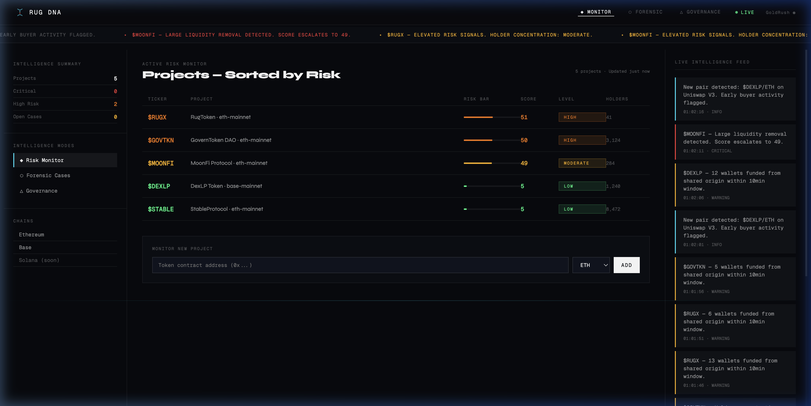

# RUG DNA — Onchain Behavioral Intelligence

> **Built for the [Build with GoldRush](https://goldrush.dev) Track · Superteam Earn Hackathon** &nbsp;·&nbsp; [🚀 Live Demo](https://rug-dna-live.vercel.app) &nbsp;



---

## ⚡ TLDR

**RUG DNA** is an onchain surveillance platform that monitors token launches in real time, scores them for rug-pull risk (0–100), auto-generates forensic case files when a project breaches a critical threshold, and evaluates DAO governance health — powered end-to-end by the **GoldRush APIs** (`@covalenthq/client-sdk`).

| Capability | What it does |
|---|---|
| 🔴 Risk Scoring | Heuristic engine scores each token 0–100 across 6 signal categories |
| 🔬 Forensic Mode | Auto-generates case files with timeline & extraction path built strictly from observed onchain events |
| 🏛 Governance Trust | Decentralization credibility score from real holder distribution |
| 📡 Live Feed | Streaming worker consumes GoldRush `newPairs`/`updatePairs` and feeds an SSE ticker |

---

## 🏗 Architecture

```
┌────────────────────────────────────────────────────────────────┐
│                        GoldRush APIs                           │
│  Foundational REST (holders · txs · balances)                  │
│  Streaming GraphQL/WS (newPairs · updatePairs)                 │
└──────────┬──────────────────────────────┬──────────────────────┘
           │ @covalenthq/client-sdk       │ @covalenthq/client-sdk
           ▼                              ▼
   ┌──────────────────┐        ┌─────────────────────────┐
   │  lib/goldrush.ts │        │ worker/stream-worker.ts │
   │  (REST client)   │        │ (always-on WS consumer) │
   └────────┬─────────┘        └───────────┬─────────────┘
            │                              │
     risk-engine · graph-builder · forensic-engine · governance-engine
            │                              │
            └──────────┬───────────────────┘
                       ▼
              lib/db.ts — Postgres (Neon)
              (in-memory fallback for local dev)
                       │
              Next.js 16 API routes
   /api/projects · /api/stream (SSE reader) · /api/forensic · /api/governance
                       │
              Next.js 16 Frontend (React 19)
```

Two processes share one Postgres store:

1. **The Next.js app** (Vercel) — serves the UI and API routes; on first request it seeds a watchlist of well-known tokens via the Foundational REST API.
2. **The streaming worker** (any always-on Node host — Railway/Render/Fly) — holds the GoldRush Streaming WebSocket, ingests newly created DEX pairs on Ethereum and Solana, watches their liquidity in real time, and writes rug-pull alerts into the store. Serverless functions can't hold a WebSocket, which is why this is a separate process.

## 🔗 GoldRush Integration

### Foundational REST (EVM chains)

| SDK call | Purpose |
|---|---|
| `BalanceService.getTokenHoldersV2ForTokenAddressByPage` | Holder concentration + token metadata (one call) |
| `TransactionService.getEarliestTransactionsForAddress` | Real deployer + launch date + genuine early buyers |
| `TransactionService.getAllTransactionsForAddressByPage` | Recent activity + deployer contract-creation history |
| `BalanceService.getTokenBalancesForWalletAddress` | Wallet balances (works on Solana, base58) |

Holder share is computed from `balance / total_supply`. Errors (rate limits, outages) are distinguished from empty results so a failed fetch can never masquerade as a low-risk score.

### Streaming API (real-time; Ethereum + Solana)

| Subscription | Purpose |
|---|---|
| `newPairs` | Launch discovery — carries deployer, initial liquidity, market cap, token metadata |
| `updatePairs` | Live liquidity/price — a >50% liquidity drop raises a critical alert and re-scores the project |

Solana REST coverage is balances-only, so all Solana intelligence is streaming-first by design.

### Risk signals

```
┌──────────────────────────────┬───────────────────────────────────────┐
│ Signal                       │ Data source                           │
├──────────────────────────────┼───────────────────────────────────────┤
│ Deployer reuse               │ earliest txs → deployer → creations   │
│ Holder concentration         │ token_holders_v2 (computed %)         │
│ Liquidity removal            │ updatePairs stream + decoded logs     │
│ Transfer velocity            │ transactions_v3                       │
│ Liquidity lock               │ decoded log events                    │
│ Early-buyer clustering       │ earliest txs (funding trace: roadmap) │
└──────────────────────────────┴───────────────────────────────────────┘
```

**Data honesty:** nothing in the UI is fabricated. Forensic timelines, extraction paths, and loss estimates derive only from observed onchain events; landing-page counters are live store stats; explicitly illustrative marketing examples are labeled as such. When a signal has no data source yet (e.g. Solana holder concentration), it is excluded from scoring rather than faked.

---

## 🚀 Quick Start

### Prerequisites
- Node.js 22+
- A [GoldRush API key](https://goldrush.dev) (free tier available)
- Optional: a Postgres database ([Neon](https://neon.tech) free tier) — without it the app runs on an in-memory store (fine locally, required in production)

### Installation

```bash
git clone https://github.com/adirathoreudr/rug-dna-live.git
cd rug-dna-live
npm install
cp .env.example .env.local
```

Edit `.env.local`:
```env
GOLDRUSH_API_KEY=your_key_from_goldrush.dev
DATABASE_URL=postgres://...   # optional locally
```

```bash
npm run dev        # the web app → http://localhost:3000
npm run worker     # optional: the streaming worker (needs DATABASE_URL)
```

### Adding a token to the watchlist

```bash
curl -X POST http://localhost:3000/api/projects \
  -H "Content-Type: application/json" \
  -d '{"tokenAddress": "0xYourToken", "chain": "eth-mainnet"}'
```

Requests are validated (address format, chain whitelist) and rate-limited.

---

## ☁️ Deploy

**Web app (Vercel)**
1. Import the repo at [vercel.com](https://vercel.com) — framework auto-detected.
2. Environment variables: `GOLDRUSH_API_KEY`, `DATABASE_URL`.
3. Deploy.

**Streaming worker (Railway / Render / Fly)**
1. Create a service from this repo.
2. Start command: `npm run worker` (Node 22+).
3. Environment variables: `GOLDRUSH_API_KEY`, `DATABASE_URL` (same database as the web app).

---

## 🗂 Project Structure

```
rug-dna-live/
├── app/
│   ├── page.tsx              # Landing (live stats from the store)
│   ├── dashboard/            # Intelligence console
│   ├── api/
│   │   ├── projects/         # GET list / POST ingest (validated + rate-limited)
│   │   ├── stream/           # SSE reader over the shared store
│   │   ├── forensic/         # Case files
│   │   ├── governance/       # Governance scores
│   │   └── solana/           # Solana view
│   ├── project/[id]/         # Project detail
│   ├── case/[id]/            # Forensic case file
│   └── governance/[id]/      # Governance analysis
├── lib/
│   ├── goldrush.ts           # GoldRush REST client (official SDK)
│   ├── db.ts                 # Postgres (Neon) store + in-memory fallback
│   ├── risk-engine.ts        # 0–100 heuristic risk scorer
│   ├── forensic-engine.ts    # Case files from observed events only
│   ├── governance-engine.ts  # Distribution-based trust scoring
│   ├── graph-builder.ts      # Wallet behavioral graph
│   └── ingestion.ts          # REST ingestion pipeline
├── worker/
│   └── stream-worker.ts      # GoldRush Streaming consumer (always-on)
└── types/                    # Shared TypeScript definitions
```

## 🛠 Tech Stack

| Layer | Technology |
|---|---|
| Framework | Next.js 16 (App Router) · React 19 |
| Language | TypeScript 5 |
| Onchain data | **GoldRush** Foundational REST + Streaming (`@covalenthq/client-sdk`) |
| Database | Postgres (Neon serverless driver), in-memory fallback |
| Styling | Tailwind CSS 4 + custom design tokens |
| Worker runtime | Node 22 + tsx |
| Deploy | Vercel (web) + any always-on Node host (worker) |

## 🔒 Security Notes

- Real keys live only in `.env.local` / host environment variables — `.env.example` contains placeholders only
- All GoldRush calls are server-side; the key is sent via Bearer header only (never in URLs)
- `POST /api/projects` validates input and rate-limits to protect API credits

## 📜 License

MIT © 2025

---

*Built for the [GoldRush Hackathon Track](https://goldrush.dev) on Superteam Earn.*
